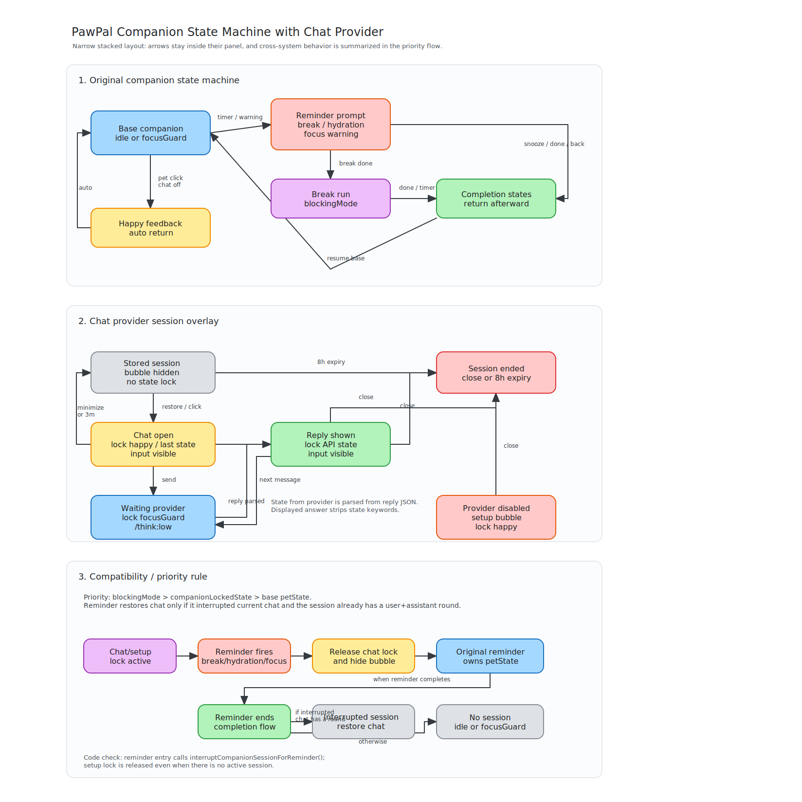

# Chat Companion Design

这份文档总结 PawPal 聊天伴侣功能的当前设计。聊天能力被实现为主进程里的可选模块，默认通过 OpenAI-compatible Chat Completions API 连接远端 provider，并把回复结果映射回 PawPal 原有的伴侣状态机。

## 目标

- 让 PawPal 可以从托盘、右键菜单或点击桌宠进入聊天模式。
- 保持原有提醒、专注、喝水、休息等 companion 状态机行为稳定。
- 让聊天模块可以通过配置关闭，也可以替换成不同 OpenAI-compatible provider。
- 让 provider 在回答内容之外返回一个 PawPal 可用状态，主进程负责提取状态并切换桌宠动画。
- 在设置页提供 provider、模型、prompt、session、diagnostics 等可观测配置。

## 模块边界

聊天相关主逻辑集中在 `src/main/chat/`：

- `config.ts`：聊天模块开关、默认归一化、超时范围限制、历史条数限制。
- `index.ts`：session 生命周期、状态锁、provider 调用、prompt 协议、回复解析、IPC 注册。
- `provider.ts`：OpenAI-compatible HTTP 适配层，包括 `/chat/completions` 和 `/models`。
- `types.ts`：主进程宿主接口 `ChatModuleHost` 和模块能力接口 `ChatModule`。

主进程 `src/main/main.ts` 只保留集成点：

- 通过 `CHAT_MODULE_ENABLED` 控制是否动态加载 `createChatModule()`。
- 把 settings、session store、bubble、pet state、window visibility、settings window 等能力作为 host callbacks 注入 chat module。
- 在 reminders/focus warnings 触发时调用 `interruptForReminder()`。
- 在 reminder 结束后调用 `restoreAfterReminder()`，决定是否恢复未结束的聊天状态。
- 在菜单中显示开始/隐藏聊天、重置聊天会话等入口。

renderer 侧只处理展示和输入：

- `PetView.tsx` 渲染可输入 speech bubble、dismiss button、统一滚动条和链接。
- `SettingsView.tsx` 渲染 Chat Companion 配置、模型列表、诊断信息和 session history。
- `preload/index.ts` 暴露 `sendCompanionMessage()`、`listChatModels()`、`dismissBubble()` 和 `companionActivity()`。

## Provider 抽象

当前版本只支持 OpenAI-compatible entries。内置 profiles 定义在 `src/shared/constants.ts`：

- `openai`
- `gemini`
- `kimi`
- `deepseek`
- `openclaw`
- `openai-compatible`

profile 只提供默认值：

- `baseUrl`
- `model`
- `thinkingPrefix`

用户切换 profile 时会重置 API key，并把 URL、模型和指令前缀切换到对应 profile 默认值。之后用户仍然可以手动修改这些字段。

`provider.ts` 接受两种 URL 形态：

- 完整 endpoint，例如 `https://api.openai.com/v1/chat/completions`。
- provider base URL，例如 `https://api.openai.com/v1`，模块会补齐 `/chat/completions` 或 `/models`。

请求发送时：

- API key 通过 `Authorization: Bearer <key>` 发送。
- `model` 来自 settings。
- `messages` 使用 OpenAI Chat Completions 格式。
- `/models` 支持读取 `{ data: [...] }` 或 `{ models: [...] }`。

## Prompt 和回复协议

主进程会把用户配置的 `chatSystemPrompt` 和 PawPal 状态协议组合成 system prompt。协议要求 provider 返回 JSON：

```json
{"state":"happy","reply":"your user-facing reply"}
```

`state` 必须来自 `COMPANION_AVAILABLE_STATES`，这个列表定义在 `src/shared/types.ts`，紧跟 `PetState` 类型，确保主进程、renderer 和 prompt 使用同一组可用状态。

`reply` 是直接展示给用户的文本，不应包含状态关键字、JSON 说明或 Markdown 格式。prompt 会额外要求普通聊天语气、不要 Markdown、不要 bullet point、不要破折号。

为了兼容不完全遵循协议的 provider，解析器会依次尝试：

- 纯 JSON。
- 自然语言里嵌入的 JSON object。
- XML-like `<state>` 和 `<reply>`。
- 单独一行 `state:` 或 `状态:`。
- inline `[[state:...]]`。

如果没有解析出状态，默认使用 `happy`。展示文本会清理 code fence、bold/italic 标记、列表符号、state 标记和破折号。

`chatThinkingPrefix` 会加到每一条 user message 前面。OpenClaw profile 默认使用 `/think:low`，其他 provider 默认留空。

## Session 生命周期

session 存在 `electron-store` 的 `companionSession` 中，类型是 `CompanionSession`：

- `id`
- `startedAt`
- `lastActivityAt`
- `lastState`
- `messages`
- `endedAt`
- `endReason`

创建 session 的入口：

- 用户开始聊天。
- 用户发送第一条消息时如果没有 active session，会创建新 session。

保留 session 的设计：

- 关闭聊天气泡只是隐藏聊天状态，不结束 session。
- 只保留最近一次 session。
- 重新加载后，如果 session 未结束且至少有一轮 user/assistant 对话，可以恢复最后一次回复。

结束 session 的机制：

- 用户点击菜单里的重置聊天会话。
- session 距离上一次聊天活动超过 `chatSessionExpiryHours`，默认 8 小时。

聊天状态超时：

- `chatCompanionInactivityMinutes` 默认 3 分钟。
- 任何聊天活动会刷新 `lastActivityAt` 并重置 timer，例如输入、点击 bubble、收到 provider 回复。
- 超时后释放状态锁并隐藏 bubble，但不结束 session。

## 状态机集成

聊天状态不是替代原有 companion 状态机，而是一个 overlay。它通过 `stateLock` 暂时锁定 PawPal 状态，并在释放后回到 host 提供的 fallback 状态：

- focus mode 中回到 `focusGuard`。
- 非 focus mode 中回到 `idle`。

状态机图如下：



关键规则：

- 新开聊天时锁定 `happy`，显示聊天输入气泡。
- 等待 provider 回复时锁定 `focusGuard`，显示 thinking 气泡。
- provider 回复后解析 `state`，锁定到对应 PawPal 状态，并展示 `reply`。
- 用户 dismiss 聊天气泡时只隐藏聊天，不重置 session。
- reminder、hydration、break、focus warning 等 blocking mode 可以强行中断聊天显示。
- reminder 结束后，只有从聊天状态被打断且 session 已有至少一轮对话时，才恢复聊天状态。
- 如果没有可恢复聊天，则按原 companion 状态机回到 `idle` 或 `focusGuard`。

这个设计避免了聊天状态污染长期伴侣模式：主状态机仍然拥有提醒和专注流程的最高优先级，聊天只在非 blocking mode 中显示。

## UI 和配置

聊天 UI 在桌宠窗口内渲染：

- speech bubble 支持输入框和胶囊形发送按钮。
- close button 走 dismiss 逻辑，只最小化聊天气泡。
- 回复区域使用 `simplebar-react` 统一 macOS 和 Windows 滚动条样式。
- URL 会自动变成可点击链接，并显示为 `[链接]` 或 `[Link]`。
- 外部链接通过主进程 `shell.openExternal()` 打开，避免依赖 renderer window API。

设置页新增 Chat Companion section：

- 启用聊天。
- provider profile。
- Chat Completions API URL。
- API key。
- 模型输入和 `/models` 模型列表。
- 指令前缀。
- 聊天状态超时时长。
- session 过期时长。
- PawPal 人格 prompt。
- 重置聊天配置按钮。

重置聊天配置不会改变“启用聊天”的开关状态，这样用户可以在已启用聊天的情况下快速恢复 provider/prompt 默认值。

Diagnostics 下新增 Chat Companion：

- session 状态。
- 创建时间。
- 持续时间。
- 对话轮数。
- 重置倒计时。
- session history JSON。

## 可选模块开关

聊天模块由环境变量 `PAWPAL_CHAT_MODULE` 控制。以下值会关闭模块：

- `0`
- `false`
- `off`
- `disabled`

模块关闭时：

- 主进程不会动态加载 chat module。
- IPC 会返回 `Chat module is disabled.`。
- snapshot diagnostics 中 `moduleEnabled` 为 `false`。

## 生产注意点

- 当前 provider 层面向 OpenAI-compatible Chat Completions，不包含 Claude/Qwen native protocol。
- session 目前只保存最近一次，不做多会话管理。
- provider request 当前不主动 abort；聊天状态超时会隐藏 UI，但已发出的请求仍可能自然返回。
- prompt 协议要求 JSON，但 parser 已对常见非标准输出做容错。
- 本功能依赖 `electron-store` 持久化 session 和 settings，敏感 API key 也在 settings 中保存；后续如需发布到更广用户群，可以考虑迁移到系统 keychain。
